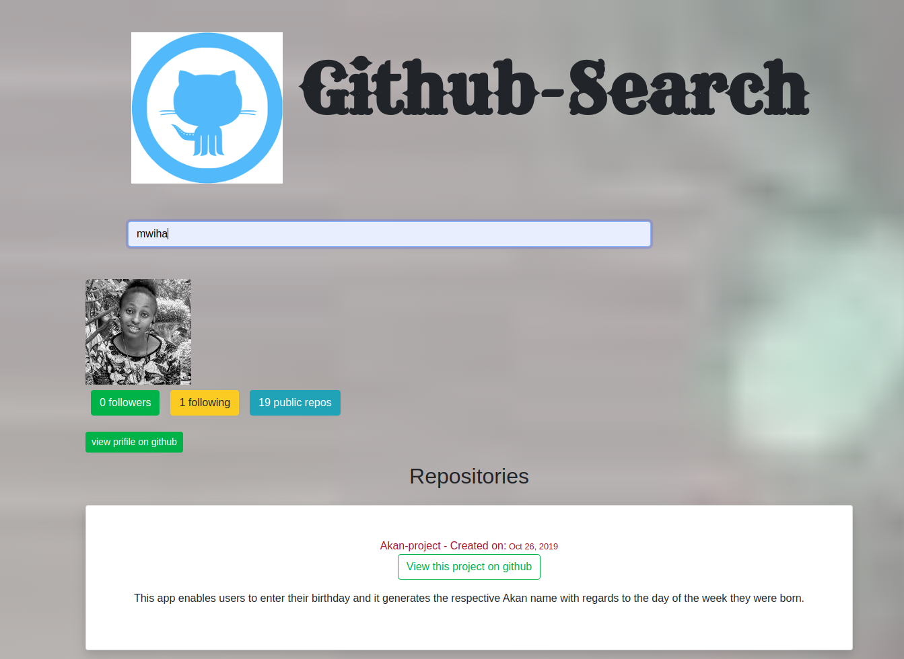

# GitSearch

## Author

- Alice Mwihaki

## Description

- This Application is used for searching repository for certain programmers

## Technology Used

- Angular
- Typescript
- Bootstrap

## BDD

- On the landing page click on the button and it will take you to the next page.

-The applications allows the user to search for a certain programmer's repo.
 once the the user puts the user name the persons details will appear

## Development

To fix any bug:

- fork the repository
- create a new branch
-fix the bug
- commit and push the changes

## Known Bugs

- Not known bugs for now

## Contacts Information

- for more information,questions or comments :(alicemwihaki99@gmail.com)

## Licence

- this project is licensed under MIT.@2019 Copyright Alice Mwihaki.
